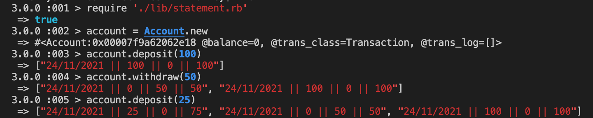

# Bank tech test

## Specification

### Requirements
- You should be able to interact with your code via a REPL like IRB or the JavaScript console. (You don't need to implement a command line interface that takes input from STDIN.)
- Deposits, withdrawal.
- Account statement (date, amount, balance) printing.
- Data can be kept in memory (it doesn't need to be stored to a database or anything).

<br/>

### Acceptance criteria
Given a client makes a deposit of 1000 on 10-01-2023
And a deposit of 2000 on 13-01-2023
And a withdrawal of 500 on 14-01-2023
When she prints her bank statement
Then she would see
```
date || credit || debit || balance
14/01/2023 || || 500.00 || 2500.00
13/01/2023 || 2000.00 || || 3000.00
10/01/2023 || 1000.00 || || 1000.00
```
---

### Approach and Structure:
I have chosen to structure the app in a way that uses three classes, Account, Transactions and Statement. It made sense to me to do it this way as a bank account can have many transactions but each transaction should be unique and so transactions should be a seperate class. An account should also have a statement which is just a print out of all of the transactions and so should be it's own class too, responsible for all formatting of the statement.

---

### How to run the app:

Make a clone of this repository.
```
git clone https://github.com/TTurvey/bank_tech_test_ruby.git
```

Install gems with:
```
bundle install
```

Start IRB:
```
irb
```

In IRB, you can peform the following:
```
require './lib/account.rb'
account = Account.new
account.deposit(<pick any amount you choose>)
account.withdraw(<pick any amount you choose>)
statement = Statement.new
statement.print_statement
```
See below a screenshot of these commands in action.


<br/>

You can run the tests with:
```
rspec
```

You can also check formatting with Rubocop:
```
rubocop
```
<br/>
